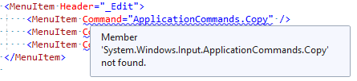

# copy-not-found

This is a WPF project that targets .NET Core 3.1. It compiles and runs just fine:

In the Visual Studio XAML designer, however, we get the squigglies:

Issues also show up in the error list:

But, as mentioned, it compiles and runs. Just fine, as it were.

The errors aren't always there; they come and go. Editing the XAML will often serve to provoke this (or, as sometimes happens, the opposite).

So: I assume this is a bug in Visual Studio? Has anyone else seen this, and if so, do you have a workaround? While this is not a showstopper, it sure is annoying...
